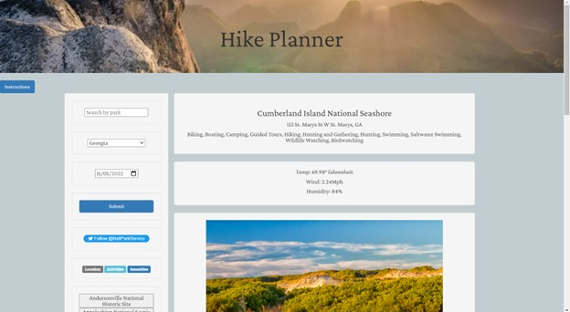

# Team-Fabulous-P1-API-Application
## Description

Application displaying usage of server-side API's that allows the user to check for National Park amenities and local weather to plan for their outdoor activities accordingly.  

## Installation

N/A

## Usage

Search for a park by name or by state. 
Select a date for the intended visit. 
Hit submit and select an option from the results list. 

## Credits

N/A

## License

Please refer to the LICENSE in the repo.

---
## Screenshots

## Deployed Application 
https://zellis117.github.io/Team-Fabulous-P1-API-Application/ 
